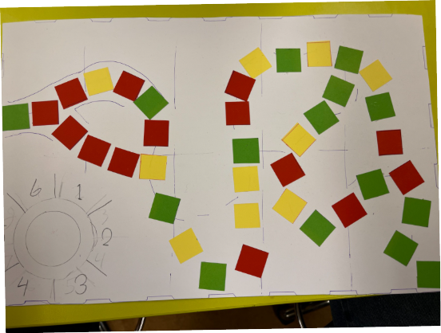

# Trivia
## Inngangur: 

Friðrik, Lára og Stefán er hópurinn okkar og hugmyndin okkar var að hafa skemmtilegt trivia spil þar sem maður fer í gegnum skóg og stoppar til að svara spurningum fyrir verðlaun eða refsingu. 

 

Hérna er mynd af pappírsfrumgerð okkar 

 

## Leik reglur 

1. Yngstur byrjar  

2. Allir byrja á byrjunar reit og fyrstur að loka reit vinnur. 

3. Þarft að lenda nákvæmlega á lokareitnum. 

4. Þú ýtir á bláa takkan til að kasta teningnum. 

5. Ef þú lendir á grænum reit þá dregurðu grænt spil. 

6. Ef þú lendir á rauðum reit þá dregurðu rautt spil. 

7. Gulir reitir gera ekki neitt. 

8. Hægt er að fá spilapeninga frá grænum spilum sem vernda þig frá rauðum spilum. 

9. Það er nokkrar leiðir sem hægt er að taka á leiðinni að lokareitnum. 

10. Þegar þú dregur spil, dregur manneskjan til hægri við þig spilið fyrir þig.

## Samþykki fyrir birtingu verkefnis á vef

Ég gef hér með samþykki mitt fyrir því að verkefnið verði birt opinberlega á vefsvæði Tækniskólans (t.d. tskoli.is og tolvubraut.is).

Með undirritun staðfesti ég að:

Ég veiti leyfi til að verkefnið og tilheyrandi myndir/skjöl/hlutar af verkefninu sé aðgengilegt almenningi á netinu.
Réttur til að draga samþykki til baka: Ég er upplýst/ur um að ég get hvenær sem er dregið samþykki mitt til baka með því að senda skriflega tilkynningu til tskoli@tskoli.is.
Réttur til að gleymast: Ef samþykki er dregið til baka mun Tækniskólinn fjarlægja verkefnið af vefsvæði sínu án ástæðulausrar tafar (samkvæmt rétti einstaklings til að gleymast, sbr. 17. gr. persónuverndarlaga).
Tækniskólinn ber ábyrgð á meðferð persónuupplýsinga samkvæmt gildandi persónuverndarlögum.
